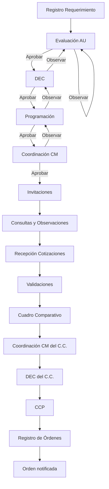

# Arquitectura funcional oficial de estados — SGC

| Campo | Valor |
|-------|--------|
| Rama de trabajo | `deploy/rc8-vps-20260725` |
| Fecha del análisis | 2026-07-28 |
| Fase | **Solo auditoría y documentación** (sin cambios de código funcional) |
| Fuente funcional obligatoria | `DETALLED ESTADOS.docx` (propietario del sistema) |
| Extracto textual | `docs/FUENTE_DETALLED_ESTADOS_extract.txt` |
| Matriz operativa | `docs/MATRIZ_ESTADOS_SGC.md` |

---

## 1. Resumen ejecutivo

El SGC mezcla hoy **tres capas distintas** bajo el mismo nombre “estado”:

1. **Etapa / módulo** del workflow (`requerimientos.estado_actual`, menús, bandejas).
2. **Estado de documento o submódulo** (cuadro, CCP, orden, cotización, validación).
3. **Situación transversal** (observado, aprobado, devuelto) a menudo sin etapa.

El documento funcional (`DETALLED ESTADOS.docx`) describe un flujo por **submódulos y capacidades**, no un único enum. Gran parte del post-orden (recepción de bienes, entregables, conformidad, ampliación contractual, resolución, pago, penalidades) está **requerida funcionalmente** y **no implementada** como máquina de estados (solo stubs de menú / checklist).

**Hallazgo crítico vigente:** en Registro de Órdenes se muestra correctamente `ORDEN_NOTIFICADA`, mientras otras bandejas siguen mostrando **CCP registrado** porque el presentador visual fuerza esa etiqueta cuando existe código CCP activo y no recibe evidencia de orden.

**Decisión arquitectónica recomendada (pendiente de aprobación del propietario):**

```text
estadoVisible = f(etapaActual, estadoVigente, situacion, evidencia)
```

No reducir la operación a un solo campo `estado`.

---

## 2. Fuente funcional utilizada

### 2.1 Documento

- Nombre: **DETALLED ESTADOS.docx**
- Ubicación leída: `C:\Users\Humberto Nizama\Downloads\DETALLED ESTADOS.docx`
- Extracto UTF-8: `docs/FUENTE_DETALLED_ESTADOS_extract.txt`

### 2.2 Regla de prevalencia

| Fuente | Prioridad |
|--------|-----------|
| Documento funcional del propietario | **1 (prevalece)** |
| Catálogos / código actual | 2 (evidencia de implementación) |
| Pruebas / comentarios / nombres antiguos | 3 (solo compatibilidad) |

Siempre se distingue:

1. Estado funcional **requerido**
2. Estado **encontrado en código**
3. Implementación **parcial**
4. **No implementado**
5. **Duplicado / inconsistente**
6. **Histórico** (mantener por compatibilidad)

### 2.3 Extracción fiel del documento (sin reinterpretar)

1. Registro de Requerimiento  
2. Evaluación de Requerimientos — observar / aprobar  
3. DEC — observar / aprobar  
4. Programación — observar / aprobar  
5. Coordinación CM — observar / aprobar  
6. Invitaciones — observar / invitación en elaboración / invitación enviada  
7. Consultas y Observaciones — consultas recibidas / consultas absueltas  
8. Recepción de Cotizaciones — cotización recibida  
9. Validaciones — validación enviada / validado por AU / observar / validación revisada por AU  
10. Cuadro Comparativo — C.C. generado / en Coordinación CM / observado / en DEC / observado DEC / aprobado  
11. CCP — CCP registrada  
12. Registro de Órdenes — orden registrada / orden notificada  
13. Recepción de Bienes — recepción almacén → acta a AU → conformidad a almacén → deriva Coordinador CM → deriva analista pago  
14. Presentación de Entregable (Servicios) — recepción AU → conformidad a Coordinador CM → deriva analista pago  
15. Ampliaciones / Resolución — editar plazo; documentación de resolución; estado visible **ORDEN RESUELTA**  
16. Derivación a Pago — revisar docs / factura / observar almacén o AU / penalidades bienes-servicios y locadores / descargar expediente  

---

## 3. Diferencia entre módulo, estado, situación, evento y documento

| Concepto | Definición operativa | Ejemplo |
|----------|----------------------|---------|
| **Submódulo / etapa** | Ubicación del expediente en el flujo | `CUADRO_COMPARATIVO`, `REGISTRO_ORDENES` |
| **Estado global vigente** | Lo que debe verse en **todas** las bandejas | `ORDEN_NOTIFICADA`, `CUADRO_COMPARATIVO_APROBADO` |
| **Estado interno** | Progreso dentro del submódulo | `PENDIENTE_REVISION_ANALISTA` |
| **Situación** | Condición transversal que no cambia necesariamente la etapa | `OBSERVADO`, `NORMAL`, `ANULADO` |
| **Evento** | Hecho trazable (entrada al historial) | `CONFORMIDAD_DERIVADA_ANALISTA` |
| **Estado documental** | Estado de un documento concreto | Acta firmada / CCP activo |
| **Actor** | Rol que ejecuta | Coordinador CM, Almacén, AU |
| **Acción** | Verbo de UI/API | observar, aprobar, derivar, notificar |

**Ejemplo del documento:**  
“Coordinador CM deriva la conformidad a un analista”

| Clasificación | Valor propuesto (pendiente aprobación) |
|---------------|----------------------------------------|
| Actor | Coordinador CM |
| Acción | Derivar conformidad |
| Evento | `CONFORMIDAD_DERIVADA_ANALISTA` |
| Estado global resultante | `PENDIENTE_REVISION_PAGO` o `EN_DERIVACION_PAGO` |
| Estado interno | `PENDIENTE_REVISION_ANALISTA` |
| Situación | `NORMAL` |

No tratar el nombre del menú como estado por defecto.

---

## 4. Mapa oficial de submódulos (funcional)

| # | Submódulo funcional | Tipo contratación | Implementación actual (código) |
|---|---------------------|-------------------|--------------------------------|
| 1 | Registro de Requerimiento | Todos | Implementado |
| 2 | Evaluación de Requerimientos | Todos | Implementado (parcial nomenclatura) |
| 3 | DEC | Todos | Implementado |
| 4 | Programación | Todos | Implementado |
| 5 | Coordinación CM (previa) | Todos | Parcial / ambiguo vs Programación |
| 6 | Invitaciones | Todos | Implementado |
| 7 | Consultas y Observaciones | Todos | Implementado (portal + bandeja) |
| 8 | Recepción de Cotizaciones | Todos | Implementado |
| 9 | Validaciones | Todos | Implementado |
| 10 | Cuadro Comparativo | Todos | Implementado |
| 11 | CCP | Todos | Implementado |
| 12 | Registro de Órdenes | Todos | Implementado (OD36/37) |
| 13 | Recepción de Bienes | Bienes | **No implementado** (stub) |
| 14 | Presentación de Entregable | Servicios | **No implementado** (stub) |
| 15 | Ampliaciones / Resolución | Todos | **No implementado** contractual (stub; existe ampliación de cronograma de cotización) |
| 16 | Derivación a Pago | Todos | **No implementado** (stub) |
| — | Penalidades (bienes/servicios/locadores) | Según tipo | **No implementado** |

**Total submódulos funcionales identificados en el documento:** **16** (+ penalidades como capacidad transversal del #16).

---

## 5. Actores del proceso

| Actor | Aparece en documento | Uso en código |
|-------|----------------------|---------------|
| Analista / Área Usuaria (AU) | Sí (evaluación, conformidad, validación) | Sí |
| DEC | Sí | Sí |
| Programación | Sí | Sí |
| Coordinador CM | Sí | Sí (cuadro / validaciones) |
| Almacén | Sí (bienes) | Menú / placeholder |
| Proveedor | Implícito (cotización / orden) | Portal implementado |
| Analista de pago / trámite | Sí (derivación a pago) | Stub |
| OPPM | No en doc estados; sí en código CCP | Sí (CCP) |

**Total actores principales:** **8** (incl. OPPM operativo actual).

---

## 6. Flujo común previo a la orden



**Notas**

- Coordinación CM aparece **antes** de Invitaciones y **otra vez** sobre el Cuadro: son dos contextos distintos (no un solo código `COORDINACION_CM`).
- DEC aparece en requerimiento y en cuadro: mismos actor, **estados distintos**.
- Consultas pueden ser estado interno del expediente de convocatoria sin desplazar el global, según decisión pendiente.

---

## 7. Flujo de bienes (post-orden) — funcional

```text
ORDEN_NOTIFICADA
  → BIEN_RECIBIDO_ALMACEN
  → ACTA_ENVIADA_AREA_USUARIA
  → ACTA_CONFORMIDAD_RECIBIDA_ALMACEN
  → CONFORMIDAD_DERIVADA_COORDINACION_CM
  → CONFORMIDAD_DERIVADA_ANALISTA
  → EXPEDIENTE_LISTO_PAGO / EXPEDIENTE_DERIVADO_PAGO
```

**Estado en código:** no hay máquina de estados de recepción física. Existe solo:

- confirmación de **recepción de la orden** por el proveedor (`ORDEN_RECEPCION_CONFIRMADA`);
- cronograma de entregas;
- stubs de menú Almacén / Ejecución.

---

## 8. Flujo de servicios (post-orden) — funcional

```text
ORDEN_NOTIFICADA
  → ENTREGABLE_PRESENTADO / RECIBIDO_AU
  → ACTA_CONFORMIDAD_SERVICIO
  → CONFORMIDAD_DERIVADA_COORDINACION_CM
  → CONFORMIDAD_DERIVADA_ANALISTA
  → EXPEDIENTE_LISTO_PAGO / EXPEDIENTE_DERIVADO_PAGO
```

**Estado en código:** cronograma con tipo `ENTREGABLE` / `PRESTACION`; vista “Presentación entregable” en construcción.  
**Regla:** el estado de **una** entrega no debe sobrescribir el estado global de la orden mientras existan otras pendientes (decisión de diseño pendiente de formalizar).

---

## 9. Flujo de locadores — resultado del análisis

El documento funcional menciona **penalidades para locadores** en Derivación a Pago, pero **no define** un flujo de recepción/conformidad distinto al de servicios.

En código:

- tipificación `locador` aparece en sugerencia OC/OS y tipos de contratación;
- no hay submódulo dedicado de locadores post-orden;
- no hay fórmulas de penalidad.

**Conclusión:** flujo de locadores = **no determinado**. Registrar como decisión pendiente (#16 en sección 39).

---

## 10. Flujo de ampliaciones

| Aspecto | Documento funcional | Código actual |
|---------|---------------------|---------------|
| Qué hace | Registrar ampliación; editar plazo; afecta tiempos totales | Stub `ampliacionResolucionView`; tabla `ampliaciones_plazo` es de **cronograma de cotización**, no contractual |
| Conservar historial | Obligatorio (regla de arquitectura) | No implementado para orden |
| ¿Cambia estado global? | No definido | — |

**Recomendación:** modelar ampliación como **situación / atributo / evento** de la orden, más historial de plazos (`plazo_original`, `plazo_nuevo`, `fecha_aprobacion`, `usuario`, `motivo`, `documento`). No borrar plazos previos.

---

## 11. Flujo de resolución

| Aspecto | Documento | Código |
|---------|-----------|--------|
| Estado visible obligatorio | **ORDEN RESUELTA** | No existe `ORDEN_RESUELTA` |
| Documentación | Sustento + anexos | Stub |
| Terminal / parcial / reversión | No definido | — |

Código canónico propuesto: `ORDEN_RESUELTA` (etiqueta: “Orden resuelta”).

---

## 12. Flujo de derivación a pago

Capacidades del documento:

1. Analista revisa documentación derivada por Coordinador CM  
2. Registra factura  
3. Puede observar a almacén o AU  
4. Adjunta / agrega documentos  
5. Calcula penalidades bienes/servicios  
6. Calcula penalidades locadores  
7. Descarga expediente completo para derivar a pago por SGC  

**Código:** vista stub; checklist `PAGO` solo verifica `en_ejecucion`.  
No introducir aún estados contables (`DEVENGADO`, `GIRADO`, `PAGADO`) salvo como ampliación futura.

---

## 13. Inventario de estados encontrados en código

### 13.1 Fuentes técnicas principales

| Archivo | Rol |
|---------|-----|
| `core/common/ConstantesEstados.js` | Catálogo legacy/core requerimiento |
| `core/workflowEngine/WorkflowState.js` | `ETAPAS` ASCII |
| `shared/estadoExpedienteVigente.js` | Prioridad cuadro→CCP→órdenes |
| `shared/observacionesMotor.js` | Ciclo de observaciones |
| `shared/expedienteChecklist.js` | Checklist por etapa |
| `server/lib/ordenesContratacion.js` | `ESTADOS_ORDEN` |
| `server/lib/cuadroComparativo.js` | `ESTADOS_CUADRO` |
| `server/lib/cuadroComparativoRevision.js` | Revisión Coordinador/DEC |
| `server/lib/ccpCertificacion.js` / `ccpEstadoFlags.js` | CCP bandeja + flags |
| `src/utils/estadoVisualPresenter.js` | Presentador bandejas generales |
| `src/utils/ordenesUtils.js` | Menú acciones por estado orden |

### 13.2 Tablas / columnas (resumen)

| Tabla | Columna | Familia |
|-------|---------|---------|
| `requerimientos` | `estado`, `estado_actual`, historiales JSONB | Global / etapa |
| `cuadros_comparativos` | `estado` | Cuadro |
| `ccp_codigos` | `estado` (`ACTIVO`) | Documento CCP |
| `ccp_solicitudes` | `estado` | CCP |
| `ordenes_contratacion` | `estado`, `enviado_proveedor_at`, `recibido_proveedor_at` | Orden |
| `orden_entregas` | `estado` ACTIVO/ANULADO | Interno cronograma |
| `orden_envios_proveedor` | `estado` ENVIADO/CONFIRMADO | Envío |
| `solicitudes_cotizacion` | `estado` | Invitaciones |
| `invitacion_proveedores` | `estado` / `estado_invitacion` | Proveedor |
| `cotizaciones_proveedor` | `estado`, `validacion_estado` | Cotización / validación |
| `consultas_proveedor` / `observaciones_proveedor` | `estado` | Consultas |
| `programacion` | `estado` | Programación |
| Legacy `ordenes` / `siaf` | `estado` / `fase` | Histórico catálogo |

### 13.3 Familias de códigos (conteo aproximado)

| Familia | Códigos distintos (orden de magnitud) |
|---------|----------------------------------------|
| Etapas workflow ASCII | ~16 |
| Labels core acentuados | ~12 |
| Observaciones | ~7 (+ legacy) |
| Módulo operativo | ~12 |
| Cuadro / revisión | ~20+ |
| CCP | ~8 |
| Órdenes (canónicos + aliases) | ~15+ |
| Portal / cotización / validación | ~15+ |
| **Total códigos/etiquetas encontrados** | **≈ 100+** (incluye duplicados y legacy) |

Detalle operativo: ver `docs/MATRIZ_ESTADOS_SGC.md`.

---

## 14. Inventario funcional requerido (del documento)

Códigos **candidatos** (no aprobados aún). Clasificación sugerida:

| Código candidato | Tipo sugerido | Submódulo |
|------------------|---------------|-----------|
| `REQUERIMIENTO_REGISTRADO` | global | Registro |
| `REQUERIMIENTO_EN_EVALUACION` | global | Evaluación |
| `REQUERIMIENTO_OBSERVADO` | global+situación | Evaluación |
| `REQUERIMIENTO_APROBADO` | global | Evaluación |
| `REQUERIMIENTO_EN_DEC` | global | DEC |
| `REQUERIMIENTO_OBSERVADO_DEC` | global+situación | DEC |
| `REQUERIMIENTO_APROBADO_DEC` | global | DEC |
| `EN_PROGRAMACION` | global | Programación |
| `PROGRAMACION_OBSERVADA` | global+situación | Programación |
| `PROGRAMACION_APROBADA` | global | Programación |
| `EN_COORDINACION_CM` | global | Coord. CM previa |
| `COORDINACION_CM_OBSERVADA` | global+situación | Coord. CM |
| `COORDINACION_CM_APROBADA` | global | Coord. CM |
| `INVITACION_EN_ELABORACION` | global/interno | Invitaciones |
| `INVITACION_OBSERVADA` | situación | Invitaciones |
| `INVITACION_ENVIADA` | global | Invitaciones |
| `CONSULTAS_RECIBIDAS` | interno/global? | Consultas |
| `CONSULTAS_ABSUELTAS` | interno/global? | Consultas |
| `COTIZACION_RECIBIDA` | cotización | Recepción cotiz. |
| `COTIZACIONES_RECIBIDAS` | global? | Recepción cotiz. |
| `VALIDACION_ENVIADA` | interno/global | Validaciones |
| `VALIDADO_POR_AU` | interno/global | Validaciones |
| `VALIDACION_OBSERVADA` | situación | Validaciones |
| `VALIDACION_REVISADA_POR_AU` | interno | Validaciones |
| `CUADRO_COMPARATIVO_GENERADO` | global | Cuadro |
| `CUADRO_EN_COORDINACION_CM` | global | Cuadro |
| `CUADRO_OBSERVADO_COORDINACION_CM` | global+situación | Cuadro |
| `CUADRO_EN_DEC` | global | Cuadro |
| `CUADRO_OBSERVADO_DEC` | global+situación | Cuadro |
| `CUADRO_COMPARATIVO_APROBADO` | global | Cuadro |
| `CCP_REGISTRADA` | global (doc) / código hoy `CCP_REGISTRADO` | CCP |
| `ORDEN_REGISTRADA` | global | Órdenes |
| `ORDEN_NOTIFICADA` | global | Órdenes |
| Estados bienes §9 | recepción/conformidad | Bienes |
| Estados servicios §10 | entregable/conformidad | Servicios |
| `ORDEN_RESUELTA` | global terminal/transversal | Resolución |
| Estados pago §13 | pago | Derivación pago |

**Total estados funcionales requeridos (candidatos documentados):** **≈ 55–70** según si se adoptan todos los de bienes/servicios/pago.

---

## 15. Matriz de equivalencias (muestra crítica)

| Funcional (doc) | Código código actual | Tipo | Gap |
|-----------------|----------------------|------|-----|
| CCP registrada | `CCP_REGISTRADO` | global overlay | Género etiqueta; OK semántico |
| Orden registrada | `ORDEN_REGISTRADA` (+ aliases) | global | Parcial aliases |
| Orden notificada | `ORDEN_NOTIFICADA` ← `ORDEN_ENVIADA*` | global | Alias “enviada” vs “notificada” |
| C.C. en Coordinación CM | `PENDIENTE_COORDINADOR` / `FIRMADO_COORDINADOR` | cuadro | Nombres distintos |
| C.C. observado Coord. | `OBSERVADO_COORDINADOR` | cuadro+situación | OK parcial |
| C.C. en DEC | `PENDIENTE_DEC` | cuadro | OK parcial |
| C.C. aprobado | `APROBADO_DEC` / `DERIVADO_CCP` | cuadro | “Aprobado” vs “Derivado” |
| ORDEN RESUELTA | — | — | **Faltante** |
| Recepción bien / conformidad | — | — | **Faltante** |
| Entregable / conformidad servicio | — | — | **Faltante** |
| Derivación a pago | stub | — | **Faltante** |

---

## 16–28. Catálogos propuestos por familia

### Modelo único recomendado

Preferir **estado de etapa + situación** sobre enums combinados largos:

```json
{
  "etapa": "CUADRO_COMPARATIVO",
  "estadoGlobal": "CUADRO_EN_COORDINACION_CM",
  "situacion": "OBSERVADO",
  "estadoInterno": "PENDIENTE_SUBSANACION_ANALISTA",
  "evidencia": { "fuente": "cuadros_comparativos", "id": 123 }
}
```

Equivalente visible: “C.C. en Coordinación CM — Observado”.

Alternativa monolítica `CUADRO_EN_COORDINACION_CM_OBSERVADO` es aceptable solo si se genera desde el mismo contrato (no como tercera fuente independiente).

### Situaciones transversales

| Código | Uso |
|--------|-----|
| `NORMAL` | Sin incidencia |
| `OBSERVADO` | Requiere origen/destino |
| `DEVUELTO` | Requiere origen/destino (no usar solo) |
| `SUSPENDIDO` | Pendiente definir |
| `ANULADO` | Terminal local |
| `RESUELTO` / orden `ORDEN_RESUELTA` | Cierre especial |
| `CANCELADO` | Pendiente definir si existe |

### Prioridad global propuesta (rangos)

| Rango | Etapa |
|------:|-------|
| 100 | Requerimientos / Evaluación |
| 200 | DEC / Programación |
| 300 | Coordinación CM previa |
| 400 | Invitaciones / Consultas |
| 500 | Cotizaciones / Validaciones |
| 600 | Cuadro Comparativo |
| 700 | CCP |
| 800 | Registro de Órdenes |
| 900 | Recepción bienes / Entregables |
| 1000 | Conformidad |
| 1100 | Derivación a pago |
| 1200 | Orden resuelta / cierre |

**Reglas obligatorias (del brief, adoptadas):**

- `ORDEN_NOTIFICADA` > `CCP_REGISTRADA`/`CCP_REGISTRADO`
- Recepción de bien / entregable > `ORDEN_NOTIFICADA`
- Conformidad derivada > recepción/presentación
- `EXPEDIENTE_DERIVADO_PAGO` > conformidad
- `ORDEN_RESUELTA` terminal o transversal según decisión
- Estado interno documental **no** retrocede el global

---

## 29. Matriz de transiciones (común — esquemática)

Ver detalle por fila en `MATRIZ_ESTADOS_SGC.md`. Resumen:

```text
REGISTRADO → EVALUACION → DEC → PROGRAMACION → COORD_CM → INVITACIONES
→ CONSULTAS → COTIZACIONES → VALIDACIONES → CUADRO → CCP → ORDENES
→ (BIENES | SERVICIOS) → CONFORMIDAD → PAGO
∥ AMPLIACION (transversal)
∥ ORDEN_RESUELTA (cierre especial)
```

Observaciones: `estadoGlobal` = etapa de **destino**; evento `DEVUELTO_POR_X_DESDE_Y`; `situacion=OBSERVADO`; motivo obligatorio.

---

## 30. Prioridad global (implementación actual vs objetivo)

**Actual** (`PRIORIDAD_ESTADO_CUADRO`): ordena bien cuadro→CCP→órdenes **si** se alimenta evidencia de orden.

**Falla de presentación:** `estadoVisualPresenter` fuerza texto “CCP registrado” cuando `ccpRegistrado=true`, aunque el resolvedor haya elegido un código de orden.

---

## 31. Observaciones y devoluciones

| Regla | Contenido |
|-------|-----------|
| Quién observa | Actor del submódulo |
| Hacia dónde retorna | Módulo destino explícito |
| Motivo | Obligatorio |
| Documentos | Adjuntos opcionales |
| Visible | Etapa destino + situación OBSERVADO |
| Historial | Conservar ciclo `EMITIDA`…`CERRADA` |

Prohibido: badge genérico `DEVUELTO` / `OBSERVADO` sin etapa.

---

## 32. Estados terminales

| Código | Condición |
|--------|-----------|
| `FINALIZADO` / archivo | Cierre clásico (legacy) |
| `ORDEN_ANULADA` | Anulación de orden |
| `ORDEN_RESUELTA` | Resolución fundamentada (funcional) |
| `EXPEDIENTE_DERIVADO_PAGO` | Posible fin operativo SGC (decisión #15) |
| `ANULADO` (cuadro/CCP) | Terminal local del documento |

---

## 33. Inconsistencias encontradas

### CRÍTICAS

1. **Bandejas muestran CCP registrado tras orden notificada** (presentador + falta de evidencia orden en enrich CCP).  
2. **Post-orden funcional (bienes/servicios/pago) no implementado** → riesgo de seguir parcheando bandejas.  
3. **Tres capas de “estado de requerimiento”** (label acentuado / etapa ASCII / texto humano) sin normalizador único consumido por todas las vistas.

### ALTAS

4. `ORDEN_ENVIADA` vs `ORDEN_NOTIFICADA` (mismo significado UI, códigos distintos en DB).  
5. Catálogos duplicados FE/BE de cuadro.  
6. `CCP_REGISTRADO` no es valor CHECK de `cuadros_comparativos.estado` (overlay).  
7. `OBSERVADO` sobrecargado (obs, cuadro, validación, requerimiento).  

### MEDIAS

8. Estados definidos sin generación (eventos de liquidación/contrato en catálogos).  
9. Checklist de pago/recepción/ejecución stub.  
10. Ampliación de cotización ≠ ampliación contractual.  

### BAJAS

11. Etiqueta “CCP registrada” (doc) vs “CCP registrado” (código).  
12. Legacy `ordenes` vs `ordenes_contratacion`.  

---

## 34. Causa raíz del caso CCP / Orden

### Hechos

1. Registro de Órdenes setea `orden_estado` / `enviado_proveedor_at` y usa `renderBadgeEstadoVigenteHtml` → muestra **Orden notificada**.  
2. Otras bandejas usan `attachCcpFlagsToRows` / `enrichRequerimientoRowsWithCcp`, que **solo** adjunta flags CCP (`ccp_activo`, `codigo_ccp`, `estado_ccp=CCP_REGISTRADO`), **sin** campos de orden.  
3. `resolveEstadoActualExpediente` sin evidencia de orden → gana `CCP_REGISTRADO`.  
4. Aunque el resolvedor devolviera orden, `src/utils/estadoVisualPresenter.js` hace:

```text
si ccpRegistrado → etapaMostrada = CCP_REGISTRADO
si ccpRegistrado → textoPrincipal = "CCP registrado"
```

5. No existe `notificado_at`; la evidencia es `enviado_proveedor_at` + estado `ORDEN_NOTIFICADA` (aliases `ORDEN_ENVIADA*`).  
6. No hay caché frontend específica del bug: es **consulta incompleta + presentador**.

### Conclusión

**Causa raíz:** resolvedor/presentador de bandejas generales priorizan/forzan CCP activo y **no consolidan evidencia de orden notificada**, a diferencia de la bandeja de Registro de Órdenes.

**Esta fase no corrige el código** (solo documenta).

---

## 35. Arquitectura definitiva recomendada (no implementar aún)

### Contrato de estado visible

```json
{
  "expedienteId": 1,
  "tipoContratacion": "BIEN|SERVICIO|LOCADOR",
  "etapaActual": { "codigo": "REGISTRO_ORDENES", "label": "Registro de Órdenes", "modulo": "contratacion" },
  "estadoVigente": { "codigo": "ORDEN_NOTIFICADA", "label": "Orden notificada", "prioridad": 840 },
  "situacion": { "codigo": "NORMAL", "label": "Normal", "motivo": null },
  "estadoInterno": { "codigo": null, "label": null, "modulo": null },
  "documentoActual": { "tipo": "ORDEN_FIRMADA", "estado": "ACTIVO" },
  "evidencia": { "fuente": "ordenes_contratacion", "registroId": 1, "fecha": "2026-07-28T05:16:47Z" }
}
```

### Componentes

1. **Catálogo central** (único)  
2. **Normalizador** de códigos históricos  
3. **Resolvedor único** de estado vigente  
4. **Cargador consolidado de evidencias** (CCP + orden + cuadro + validación + …)  
5. **Presentador común** FE (sin overrides locales que contradigan prioridad)  
6. **Historial de transiciones**  
7. **Validación de transiciones** + idempotencia  
8. **Compatibilidad** con datos antiguos  

---

## 36. Riesgos

| Riesgo | Impacto |
|--------|---------|
| Aprobar catálogo sin decidir “enviada vs notificada” | Reescritura de migraciones |
| Implementar bienes/servicios sin modelo multi-entrega | Estado global incorrecto |
| Seguir parcheando presentadores por bandeja | Recurrencia del bug CCP/Orden |
| Confundir ampliación de cotización con contractual | Datos erróneos de plazo |
| Introducir estados contables prematuros | Alcance fuera del SGC actual |

---

## 37. Plan de implementación por fases (sin ejecutar)

| Fase | Alcance | Dependencias | Riesgo | Reversión |
|------|---------|--------------|--------|-----------|
| 1 | Catálogo central + equivalencias | Aprobación propietario | Medio | Alto (solo docs/código catálogo) |
| 2 | Normalizador históricos | Fase 1 | Medio | Feature flag |
| 3 | Resolvedor único global | 1–2 | Alto | Rollback presentador |
| 4 | Cargador evidencias consolidado | 3 | Alto | Queries feature-flag |
| 5 | Integración todas las bandejas | 3–4 | Alto | Por bandeja |
| 6 | Presentador FE común | 5 | Medio | |
| 7 | Validación transiciones | 1 | Medio | |
| 8 | Historial / trazabilidad | 7 | Medio | |
| 9 | Estados bienes/servicios | Aprobación flujos | Alto | Módulo nuevo |
| 10 | Ampliaciones, resolución, pago | 9 | Alto | |
| 11 | Regularización histórica | 2–5 | Alto | Dry-run |
| 12 | Regresión completa | Todo | — | |

Archivos probables (futuro): `shared/estadoExpedienteVigente.js`, `estadoVisualPresenter.js`, `ccpEstadoFlags.js`, `trazabilidad.js`, nuevas libs post-orden, migraciones solo tras aprobación.

---

## 38. Pruebas requeridas (futuras)

1. Matriz de prioridad CCP vs Orden notificada en **todas** las bandejas.  
2. Observación con retorno origen/destino.  
3. Multi-entrega: una entrega avanzada no “cierra” la orden.  
4. Ampliación conserva plazo original.  
5. `ORDEN_RESUELTA` visible y bloquea acciones inválidas.  
6. Penalidades no cambian global hasta decisión.  
7. Regresión RC94–RC103 órdenes / cuadro / CCP.  

---

## 39. Decisiones funcionales pendientes (para el propietario)

1. ¿“Orden enviada” y “Orden notificada” son el mismo estado?  
2. ¿La recepción del proveedor debe mostrarse como estado independiente?  
3. ¿El inicio del plazo debe ser visible globalmente?  
4. ¿La recepción parcial de bienes genera estado global?  
5. ¿Una entrega parcial de servicios cambia el estado global?  
6. ¿La conformidad puede ser parcial?  
7. ¿Puede existir más de una factura por orden?  
8. ¿Puede existir pago parcial?  
9. ¿Quién aprueba una ampliación?  
10. ¿Una ampliación observada bloquea el expediente?  
11. ¿La resolución puede ser parcial?  
12. ¿`ORDEN_RESUELTA` siempre es terminal?  
13. ¿Qué sucede con entregas ya recibidas después de una resolución?  
14. ¿El analista deriva por el SGC o solo descarga el expediente?  
15. ¿El estado final del SGC será “Derivado a pago” o “Pagado”?  
16. ¿Cómo se maneja el flujo de locadores?  
17. ¿Coordinación CM previa a Invitaciones es módulo independiente o revisión dentro de Programación?  
18. ¿DEC (requerimiento) y DEC (cuadro) comparten nomenclatura o se distinguen siempre?  
19. ¿Consultas y Observaciones tienen estado global o solo internos?  
20. ¿“Cotización recibida” es por proveedor o global del expediente?  

---

## 40. Confirmaciones de esta fase

- **No** se modificó código funcional de aplicación (solo `docs/`).  
- **No** se crearon migraciones ni se alteraron datos.  
- **No** se hizo commit ni push.  
- Rama confirmada: `deploy/rc8-vps-20260725`.  

---

## Anexo A — Inventario técnico de fuentes (resumen tabular)

| # | Estructura | Columna/prop | Familia | ¿Global? | ¿Vigente? | Observación |
|---|------------|--------------|---------|----------|-----------|-------------|
| 1 | `requerimientos` | `estado_actual` | Etapa | Sí (etapa) | Sí | ASCII etapas |
| 2 | `requerimientos` | `estado` | Label humano | Ambiguo | Parcial | Legacy |
| 3 | `cuadros_comparativos` | `estado` | Cuadro | Documento/global | Sí | CHECK workflow |
| 4 | `ccp_codigos` | `estado` | Doc | No | Sí | ACTIVO |
| 5 | overlay FE/BE | `CCP_REGISTRADO` | Global overlay | Sí | Sí | No es CHECK cuadro |
| 6 | `ordenes_contratacion` | `estado` | Orden | Sí | Sí | + aliases |
| 7 | `ordenes_contratacion` | `enviado_proveedor_at` | Evidencia | — | Sí | Notificación |
| 8 | `orden_envios_proveedor` | `estado` | Envío | Interno | Sí | ENVIADO/CONFIRMADO |
| 9 | `cotizaciones_proveedor` | `validacion_estado` | Validación | Interno | Sí | |
| 10 | `payload.observaciones[]` | `estado` | Observación | Situación | Sí | Motor obs |
| 11 | Presenter | `textoPrincipal` | UI | — | Sí | Override CCP |
| 12 | Checklist shared | etapas futuras | Gate | — | Parcial | Stubs |

---

*Fin del documento de arquitectura. Usar junto con `docs/MATRIZ_ESTADOS_SGC.md` para aprobación del propietario funcional.*
